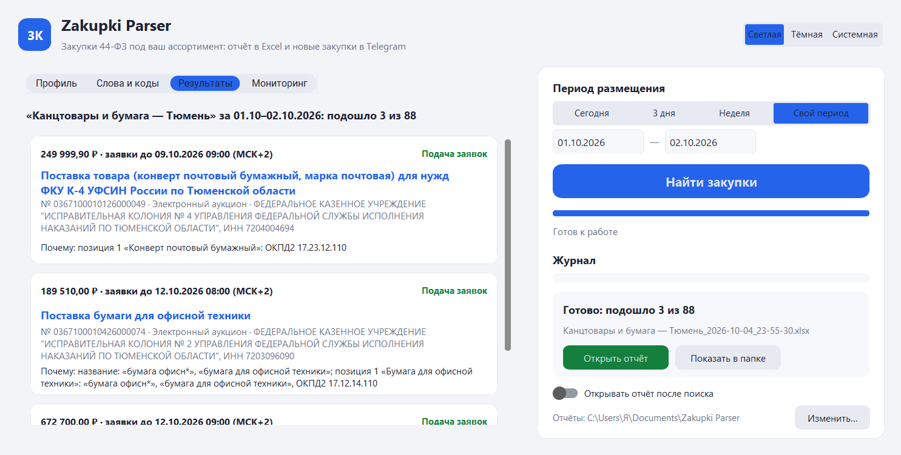
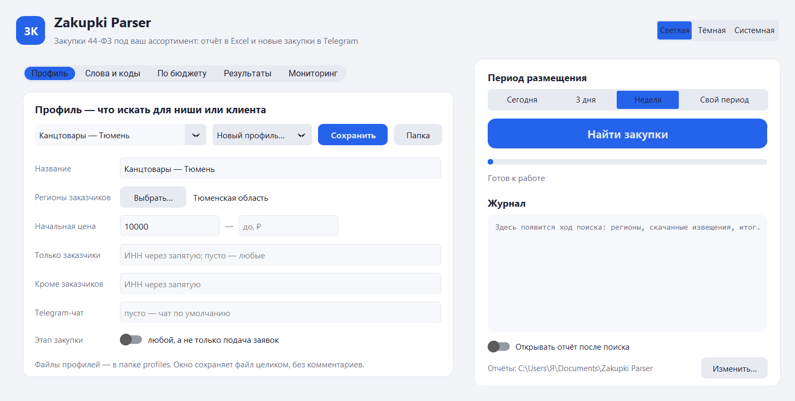
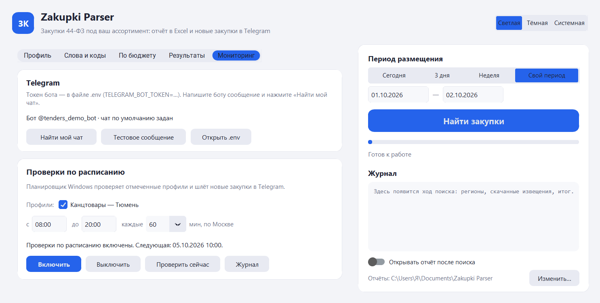
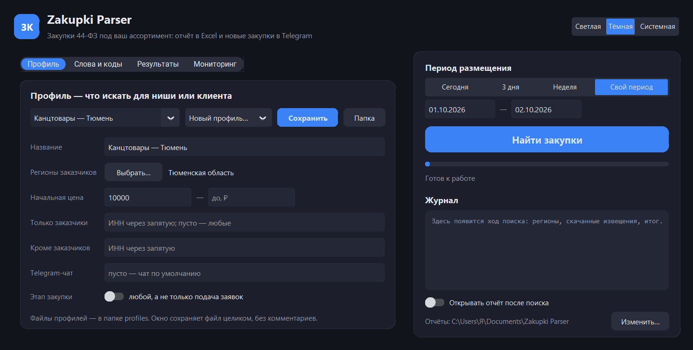
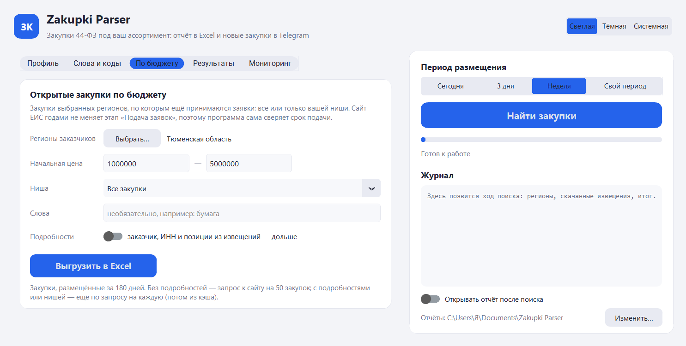

# Zakupki Parser — извещения о госзакупках 44-ФЗ в Excel

[](https://github.com/krein15/zakupki-parser/actions/workflows/tests.yml)

Парсер извещений с [zakupki.gov.ru](https://zakupki.gov.ru): отбирает закупки по ключевым словам и минус-словам
с учётом словоформ, по ИНН заказчика, региону, периоду и сумме, складывает результат в Excel и сообщает
в Telegram о новых подходящих закупках. Без ключевых слов выгружает все открытые закупки региона в диапазоне цены.

> **Статус: версия 0.8.** Готовы все этапы плана: поиск на сайте ЕИС, разбор XML, отбор по профилям, отчёт
> в Excel, мониторинг с карточками и кнопками «Беру / Не моё» в Telegram, настольное окно, выгрузка открытых
> закупок по бюджету и по нише, аудит набора ключевых слов. Разведка источника: [docs/recon.md](docs/recon.md).

[Пример отчёта](docs/example/example-report.xlsx) — 14 закупок канцтоваров в Тюменской области за сентябрь 2026.



## Окно

Регистрация, токен и электронная подпись не нужны: данные берутся с открытой части сайта ЕИС.

```bash
pip install -r requirements.txt
python app.py
```

- **Профиль** — регионы, цена, заказчики, этап и Telegram-чат; **Слова и коды** — ключевые и минус-слова, ОКПД2
  и КТРУ. Профили сохраняются в папку `profiles`.
- **Новый профиль…** — пустой или из шаблона ниши: канцтовары, лекарства, медицинские изделия, топливо, продукты,
  компьютеры, мебель, хозтовары, спецодежда, уборка, стройматериалы, IT-услуги и разработка ПО. Шаблон
  подставляет слова и коды ОКПД2, регионы остаются ваши; коды проверены на реальных закупках, но это отправная
  точка — словарь доводится под ассортимент. В IT-услугах минус-слова отсеивают перепродажу лицензий,
  сертификатов техподдержки и справочных систем: из 490 закупок, найденных по IT-словам в трёх регионах,
  лицензий и поставок было 264, а шаблон отобрал 113 услуг.
- **Найти закупки** — поиск за сегодня, 3 дня, неделю или свой период, с ходом работы в журнале и кнопкой «Остановить»
  (найденное к этому моменту сохраняется). Отчёт Excel — в `Документы\Zakupki Parser`.
- **По бюджету** — закупки выбранных регионов в диапазоне цены, по которым ещё принимаются заявки: все
  или только вашей ниши (профиль или шаблон), сразу в Excel. Подробнее — [ниже](#открытые-закупки-по-бюджету).
- **Результаты** — карточки подошедших закупок: цена, срок подачи заявок, этап, заказчик и почему закупка подошла;
  по щелчку на название открывается закупка в ЕИС.
- **Мониторинг** — бот и чат Telegram, проверки по расписанию (включить, выключить, проверить сейчас), журнал.

| Профиль | Мониторинг |
|---|---|
|  |  |

Тёмная тема переключается в шапке:



## Командная строка

Всё, что умеет окно, доступно и из командной строки — это удобно для запуска по расписанию.

```bash
python -m zkparser fetch --region 72 --date 2026-09-30 --query "медицинский"
```

Команда находит закупки на этапе «Подача заявок» и сохраняет полный XML каждой в кэш
(`%LOCALAPPDATA%\ZakupkiParser\cache`). Повторный запуск скачивает только новые и изменённые извещения.

| Параметр | Что задаёт |
|---|---|
| `--region` | код региона (`72`) или часть названия (`тюмен`); можно несколько раз. Список — `python -m zkparser regions` |
| `--date`, `--from`, `--to` | дата или период размещения, по умолчанию сегодня |
| `--query` | слова для поиска на сайте ЕИС, с учётом словоформ |
| `--price-from`, `--price-to` | начальная цена, ₽ |
| `--all-stages` | любой этап закупки, а не только подача заявок |

Разобранное извещение целиком — номер, цена, сроки подачи заявок, площадка, заказчики с ИНН, места поставки,
позиции с ОКПД2 и КТРУ:

```bash
python -m zkparser show 0167200003426008053
```

ИНН заказчика в извещении напрямую не указан: программа берёт его из идентификационного кода закупки (ИКЗ).
Это работает и тогда, когда закупку размещает не сам заказчик, а уполномоченный орган.

### Отбор по профилю

Профиль — файл с тем, что искать для одной ниши или одного клиента: регионы, ключевые и минус-слова, коды ОКПД2
и КТРУ, ИНН заказчиков, диапазон цены. Удобнее всего создать его в окне из шаблона; формат с пояснениями —
[docs/example-profile.toml](docs/example-profile.toml), шаблоны — [zkparser/templates](zkparser/templates).

```bash
python -m zkparser templates                                   # шаблоны ниш
python -m zkparser templates канц --region 72                  # профиль из шаблона → profiles/
python -m zkparser match docs/example-profile.toml --date 2026-10-02
```

```
«Канцтовары и бумага — Тюмень»: подошло 1 из 59

  0367100000926000059 · 672 700,00 ₽ · заявки до 12.10.2026 09:00
  Поставка офисной бумаги
  Заказчик: АРБИТРАЖНЫЙ СУД ТЮМЕНСКОЙ ОБЛАСТИ (ИНН 7202057669)
  Почему: название: «бумага офисн*»; позиция 1 «Бумага для офисной техники»: «бумага офисн*», ОКПД2 17.12.14.110
```

- Слова ищутся по словоформам: «картридж» найдёт «картриджей». `канцеляр*` — начало слова, фраза в кавычках —
  точный порядок слов.
- Проверяется не только название, но и каждая позиция. Закупка «Поставка бумаги и картона» подойдёт по позиции
  «Бумага для офисной техники», хотя в названии нужных слов нет.
- Минус-слово в названии отсеивает закупку, в позиции — только эту позицию.
- У каждой подошедшей закупки указано, почему она подошла.
- Несколько профилей за один запуск: каждый регион скачивается один раз, каждая закупка проверяется по всем профилям.

Свои профили храните в папке `profiles/` — в репозиторий она не попадает.

### Отчёт в Excel

`match` сохраняет отчёт в `Документы\Zakupki Parser` (другая папка — `--out`, без отчёта — `--no-excel`).
Один профиль — один файл, так что отчёт клиента можно сразу ему отправить.

- **«Закупки»** — номер (ссылка на закупку в ЕИС), название, почему подошла, начальная цена, срок подачи заявок
  с часовым поясом заказчика (МСК+2, как на сайте), способ, заказчики и их ИНН, регион, площадка, дата размещения,
  примечания (совместная закупка, количество не определено, новая редакция).
- **«Позиции»** — все позиции этих закупок с ОКПД2, КТРУ, количеством и ценой; подошедшие выделены.
- **«Профиль»** — что искали, за какой период и сколько закупок проверено.

Текст из извещений записывается только как текст: строка, начинающаяся с «=», не станет формулой.

### Открытые закупки по бюджету

«На что можно подать заявку прямо сейчас»: все закупки регионов в диапазоне начальной цены, у которых не прошёл
срок подачи заявок. Ни профиль, ни ключевые слова не нужны.

```bash
python -m zkparser export --region 72 --price-from 1000000 --price-to 5000000
```

```
Открытые закупки: Тюменская область · от 1 000 000,00 ₽ до 5 000 000,00 ₽ · размещены за 180 дней
Тюменская область: с этапом «Подача заявок» 108, из них открыто 107
Открыто 107, срок подачи уже прошёл у 1 из 108.

  0367100025626000013 · 2 355 166,67 ₽ · до 05.10.2026 (последний день)
    Поставка легкового автомобиля для нужд филиала ФГБУ «ЦЛАТИ по УФО» по Тюменской области
  0167200003426007973 · 4 641 000,00 ₽ · до 06.10.2026 (остался 1 день)
    Поставка лекарственных препаратов для медицинского применения МНН ЛИНАГЛИПТИН
  …
```

- **Этапу на сайте не верим.** ЕИС годами не меняет этап «Подача заявок» и после окончания срока: в Тюменской
  области из 855 таких закупок на 1–5 млн ₽ у 749 срок давно прошёл, самые старые — 2014 года. Программа сама
  сверяет срок подачи; в отчётах по профилям такие закупки помечены «Приём заявок окончен» и стоят после открытых.
- **Быстро.** Список берётся прямо из выдачи поиска — один запрос на 50 закупок. Ищутся закупки, размещённые
  за последние полгода: заявки обычно принимают одну-три недели, но срок бывает продлён.
- **С подробностями** (`--details`, в окне — переключатель): программа скачивает каждое извещение и добавляет
  настоящего заказчика с ИНН (в выдаче поиска часто стоит уполномоченный орган), точный срок с часовым поясом
  и лист «Позиции». Дольше — по запросу на закупку, но скачанное остаётся в кэше.
- **Только ваша ниша:** `--template IT` или `--profile profiles/мой.toml` — из открытых закупок остаются
  подходящие по словам и кодам профиля, с колонкой «Почему подошла» (подробности скачиваются автоматически).
- `--query "бумага"` — необязательно сузить словами; несколько `--region` — несколько регионов в одном отчёте.
  Тюменская и Свердловская области целиком, без ограничения цены: 1 145 открытых закупок за 25 запросов к сайту.

Отчёт — `Открытые закупки — <регион>, <цена>_<дата>.xlsx`: лист «Закупки» по возрастанию срока подачи
(с колонкой «Осталось дней») и лист «Выгрузка» — что выгружали и сколько закупок сайт ещё числит открытыми зря.



### Мониторинг и Telegram

`monitor` проверяет новые закупки по профилям и присылает в Telegram те, о которых ещё не сообщал, —
карточкой с кнопками:

```
🟢 Приобретение горюче-смазочных материалов
💰 2 359 233 ₽ · ⏳ до 09.10 10:00 МСК+2 (3 дн.)
🏛 СЛЕДСТВЕННОЕ УПРАВЛЕНИЕ СЛЕДСТВЕННОГО КОМИТЕТА РОССИЙСКОЙ ФЕДЕРАЦИИ ПО ТЮМЕНСКОЙ ОБЛАСТИ
📦 Топливо дизельное (розничная реализация) — 800 л
   Бензин автомобильный (розничная реализация) — 23 000 л
   +2 позиции
🎯 «горюче-смазочн*», «смазочн* материал*», «топливо», «дизельн* топлив*», ОКПД2 19.20.21.300, «бензин*»
Электронный аукцион · № 0167100004126000028 · Топливо и ГСМ
[✅ Беру] [❌ Не моё] [Открыть в ЕИС]
```

Кружок — сколько осталось: 🟢 больше двух дней, 🟡 день-два, 🔴 последний день. В карточке — что именно
покупают (подошедшие позиции первыми) и по каким словам и кодам закупка подошла.

**Отметки «Беру / Не моё»** показывают точность отбора: какая доля присланного действительно в работу. Каждый
понедельник бот присылает итоги недели (владельцу — по всем профилям, клиенту — по его), в любой момент — `/stats`:

```
📊 Итоги 05.10–12.10
«Канцтовары — Тюмень»: прислано 14 · ✅ 3 · ❌ 1 · без отметки 10
Точность отбора: 75% (3 из 4 отмеченных)
```

1. Создайте бота у [@BotFather](https://t.me/BotFather) и впишите токен в файл `.env` в папке программы:
   `TELEGRAM_BOT_TOKEN=…`. Файл `.env` в репозиторий не попадает.
2. Напишите боту любое сообщение и узнайте номер чата: `python -m zkparser telegram`.
3. Сделайте его чатом по умолчанию и проверьте связь: `python -m zkparser telegram --save <номер> --test`.
   У профиля может быть свой чат — параметр `telegram_chat`, например для клиента.

```bash
python -m zkparser monitor profiles/канцтовары.toml
```

- **Без пропусков.** Проверка начинается с дня прошлой проверки (не дальше недели назад): если компьютер был
  выключен, после включения придут закупки за пропущенные дни.
- **Без повторов.** О каждой закупке профиль сообщает один раз. Если Telegram был недоступен, сообщение уйдёт при
  следующей проверке; закупки с истёкшим сроком подачи заявок уже не присылаются.
- **Без лавины.** За одну проверку — до 10 сообщений на профиль, остальное одним сообщением с отчётом Excel.
- **Отчёт дня** `<профиль>_мониторинг_<дата>.xlsx` обновляется при каждой проверке.

**По расписанию** — через Планировщик Windows, время по Москве:

```bash
python -m zkparser schedule on profiles/канцтовары.toml --from 08:00 --to 20:00 --every 60
python -m zkparser schedule off
python -m zkparser schedule on
python -m zkparser schedule status
```

`on` с профилями создаёт задачу, без профилей — включает созданную; `off` выключает, сохраняя настройки.
Проверки идут без окна, пропущенная из-за выключенного компьютера запускается при включении. Вместе с проверками
включается и выключается бот, который принимает нажатия кнопок (задача «Бот», команда `python -m zkparser bot`).
Журналы — `%LOCALAPPDATA%\ZakupkiParser\logs` (`monitor.log`, `bot.log`). Токен бота в журналы не попадает: он
вырезается из всех записей и сообщений об ошибках.

**Протокол падения.** Технические сообщения уходят только владельцу (чат по умолчанию из `.env`), клиентам — никогда.

| Что случилось | Что делает программа |
|---|---|
| Ошибка в боте | журнал с причиной, вам «⚠️ Бот упал: причина», перезапуск через минуту, затем «✅ Бот снова работает» |
| Процесс бота пропал (убит, компьютер спал) | задача Планировщика поднимает его в течение 5 минут; ближайшая проверка замечает молчание, перезапускает бота и предупреждает, если он не ответил |
| Пропала связь с Telegram | повторы с растущей паузой; когда связь вернулась — «✅ Связь восстановлена» с временем перерыва |
| Проверка не удалась (сайт ЕИС недоступен и т. п.) | одно предупреждение при первом сбое и одно — когда проверки снова пошли; без спама каждый час |
| Не доходит в чат клиента | одно предупреждение вам и одно — когда доставка восстановилась |

`schedule status` и вкладка «Мониторинг» показывают, слушает ли бот кнопки и когда он последний раз был на связи.

### Аудит набора ключевых слов

Клиент присылает слова, которыми сейчас ищет закупки, — программа показывает, что они находят за неделю, сколько
из этого мусор и какие подходящие закупки он не видит. Слова и эталонный профиль ниши проверяют одни и те же
закупки: всё, что регионы разместили за период, на любом этапе.

```bash
python -m zkparser audit слова-клиента.txt --template IT --region 72 --region 66 --days 7
```

Файл слов — как их вводят в любой поиск: по одному на строку или через запятую, минус-слова с «-», `#` —
комментарий. Эталон — шаблон ниши (`--template`) или свой профиль (`--profile`); цена и регионы общие для обоих.

Отчёт `Аудит слов — <эталон>_<дата>.xlsx`:

- **«Итоги»** — главное одной фразой (например, «Из 140 закупок, найденных вашими словами, подходят 18. Ещё 9 подходящих
  закупок на 12,4 млн ₽ ваш набор пропустил»), точность и полнота, какие слова тянут мусор и чем эталон нашёл
  пропущенное;
- **«Пропущено»**, **«Мусор»**, **«Совпало»** — закупки со ссылками и причинами: почему подходит или какое слово
  сработало; крупные суммы первыми;
- **«Слова»** — каждое слово клиента: сколько нашло, сколько из этого подходит.

**Бережно к сайту.** Между запросами пауза 2,5 секунды. Если сайт просит подождать (ответ 429), программа ждёт
столько, сколько он просит, а после нескольких отказов подряд останавливается. Сертификат сайта проверяется
по корневому сертификату Минцифры, который лежит в пакете.

## План

| Этап | Что появляется | Статус |
|---|---|---|
| 1. Источник «сайт» | поиск по региону, дате, сумме и словам; XML каждой закупки в кэше | готово |
| 2. Разбор XML | номер, название, заказчик и его ИНН, сумма, сроки, площадка, позиции с ОКПД2 и КТРУ | готово |
| 3. Отбор | ключевые и минус-слова со словоформами, ИНН, сумма, коды; почему закупка подошла | готово |
| 4. Excel | отчёт с колонкой «почему подошла» | готово |
| 5. Мониторинг | запуск по расписанию, история, уведомления в Telegram о новых | готово |
| 6. Окно | настольная программа поверх ядра, сборка в .exe | готово |
| 7. Аудит | прогон набора ключевых слов за неделю: найдено, лишнее, пропущено | готово |

## Границы первой версии

**Делаем:** один закон — 44-ФЗ; один реестр — извещения о закупках; отбор по ключевым и минус-словам
со словоформами; фильтры по ИНН заказчика, региону, периоду и диапазону суммы; Excel на выходе и уведомление
в Telegram; настольное окно, как в [Marketplace Parser](https://github.com/krein15/marketplace-parser).

**Не делаем в первой версии:** 223-ФЗ, протоколы, контракты, реестр участников; аналитику победителей
и снижений; личный кабинет и веб-интерфейс; всю страну без фильтра по региону.

## Разработка

```bash
pip install -r requirements-dev.txt
pytest
ruff check .
```

Сборка программы для Windows, которой не нужен Python: `python -m PyInstaller ZakupkiParser.spec --noconfirm`
(результат — `dist\ZakupkiParser\ZakupkiParser.exe`; без параметров открывает окно, с параметрами работает как
командная строка, так её и запускает Планировщик). Снимки окна для README — `tools/screenshot.py`.

Тесты работают без интернета: поиск проверяется на сохранённых страницах ЕИС, разбор — на настоящих извещениях,
в которых данные контактного лица заменены заглушками (`tools/anonymize_notice.py`).

## Лицензия

[MIT](LICENSE)
